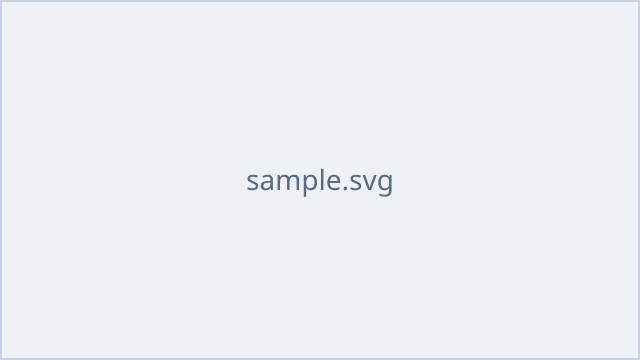

# プレゼンテーションタsss

サブタイトルをここに入力

---

## はじめに

このスライドは **タイトル + 本文** パターンのサンプルです。Markdown の記法がそのまま使えます。

- 見出し・段落・箇条書きに対応
- 画像は `images/xxx.png` の形式で参照
- コードブロックや強調も利用可能



---

## 詳細説明

複数の段落やコードブロックも記述できます。

```js
console.log("Hello, presentation!");
```

1. `content/slides.md` に `##` 見出しと `---` を使ってスライドを追加
2. 画像は `content/images/` に配置
3. `npm run build` を実行すると `dist/` に出力されます

---

## 1つのファイルから複数スライド

`---` だけの行で区切ると、1つの Markdown ファイルから
複数のスライドを作成できます。

| 項目 | 説明 |
| --- | --- |
| 分割 | `---` 単独行 |
| 見出し | 各セクション先頭の `## 見出し` がタイトルと目次になる |
