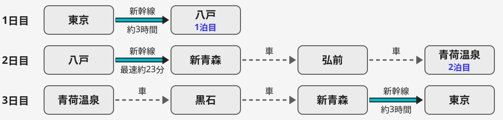

# 青森、説明のいらない3日間

東京発着 2泊3日の旅プラン(10月31日〜11月2日 想定)

---

# 名所ではなく、青森の日常に混ざる

---

## 今回は名所を巡らず、青森の日常に混ざります

- 食べる: 朝市、横丁、郷土の麺
- 歩く: 海岸の芝生、こみせ通り
- 泊まる: ランプだけの山の宿

---

## 南の八戸から津軽の山へ、新幹線と車でつなぎます

<small>レンタカー利用は想定。出典: [新幹線ガイド 東京〜八戸](https://shinkansen.tabiris.com/tokyo_hachinohe.html)、[えきたん 八戸〜新青森の新幹線(中国語版)](https://ekitan.com/zh-tw/article/hachinohe-to-aomori-shinkansen)、[新幹線ガイド はやぶさ](https://shinkansen.tabiris.com/train07.html)(2026年10月取得)</small>

---

# 1日目 南部・八戸の海と横丁

---

## 昼は種差海岸の芝生を、海を見ながら歩きます

- 海岸台地の上に広がる芝の草原
- 周辺約880haは国の名勝、三陸復興国立公園
- JR種差海岸駅から徒歩5分

<small>出典: [旅行読売 種差海岸(tabi-mag)](https://tabi-mag.jp/ao0088/)(2026年10月取得)</small>

---

## 夜は八戸の横丁をはしごし、地元の客に混ざります

- 中心街に横丁が8か所
- 入口はみろく横丁、屋台26軒
- 店は決めず、空いた席に座る

<small>出典: [東北観光推進機構 八戸横丁](https://www.tohokukanko.jp/attractions/detail_1003171.html)(2026年10月取得)</small>

---

# 2日目 朝市、りんご畑、ランプの宿

---

## 日曜の夜明けは、館鼻岸壁朝市で朝ごはんにします

- 3月中旬〜12月の毎週日曜
- 夜明け〜9時頃
- 全長約800m、およそ300店

<small>出典: [BE-PAL 夜明け前の港に現れる八戸の巨大朝市](https://www.bepal.net/archives/324050)(2026年10月取得)</small>

---

## 昼は収穫期のりんご畑で、津軽の秋に立ちます

- 八戸→新青森は新幹線で最速約23分、レンタカーで弘前へ
- 弘前市りんご公園: 80種・約2300本
- 収穫体験は2026年8月初旬〜11月中旬(予定)

<small>出典: [えきたん 八戸〜新青森の新幹線(中国語版)](https://ekitan.com/zh-tw/article/hachinohe-to-aomori-shinkansen)、[るるぶ&more 弘前のりんご狩り](https://rurubu.jp/andmore/article/3956?page=2)(2026年10月取得)</small>

---

## 夜はランプだけが灯る、山の一軒宿に泊まります

- 明かりはランプだけ、テレビ・ラジオなし
- 温泉風呂は4か所
- 道の駅虹の湖から送迎、迎えは15時・16時(11月30日まで、要事前連絡)

<small>出典: [近畿日本ツーリスト ランプの宿 青荷温泉](https://yado.knt.co.jp/st/S020064/)(2026年10月取得)</small>

---

# 3日目 雪国の町を歩き、東京へ

---

## 黒石のこみせ通りで、雪国の知恵を歩きます

- こみせ: 積雪下でも通れるように作られた木造のアーケード
- 藩政時代からの風情
- 2005年、国の重要伝統的建造物群保存地区に

<small>出典: [Guidoor 中町こみせ通り](https://www.gltjp.com/ja/directory/item/12561/)(2026年10月取得)</small>

---

## 昼は黒石つゆやきそばで締め、新青森から帰ります

- 起源は昭和30年代に黒石の食堂で生まれた「つゆそば」
- こみせ通り沿いに専門店
- 新青森→東京は、はやぶさで約3時間

<small>出典: [旅行読売 すずのや(tabi-mag)](https://tabi-mag.jp/ao0204/)、[新幹線ガイド はやぶさ](https://shinkansen.tabiris.com/train07.html)(2026年10月取得)</small>

---

# 準備は少なく、続きは現地で

---

## 3日間は、無理のない移動で回れます

| 日付 | 朝 | 昼 | 夜・宿 |
| --- | --- | --- | --- |
| 1日目 10/31(土) | 東京→八戸(新幹線) | 種差海岸を歩く | 八戸の横丁・八戸泊 |
| 2日目 11/1(日) | 館鼻岸壁朝市 | 新青森から車で弘前のりんご畑 | 青荷温泉泊(道の駅虹の湖から送迎) |
| 3日目 11/2(月) | 黒石・こみせ通り | つゆやきそば | 新青森→東京(新幹線) |

<small>日程とレンタカー利用は想定。出典: 各スライドに記載</small>

---

## 決めておくのは、宿と車と新幹線だけです

- 青荷温泉: 予約と送迎の事前連絡
- レンタカー: 新青森で借りて新青森で返す(想定)
- 新幹線: 1日目の往路と3日目の復路

ほかは決めずに出かけます。

<small>出典: [近畿日本ツーリスト ランプの宿 青荷温泉](https://yado.knt.co.jp/st/S020064/)(2026年10月取得)</small>

---

## 説明はここまで。続きは、現地で味わいましょう

候補日は2026年10月31日(土)〜11月2日(月)です。

この3日間で、青森へ行きませんか。
